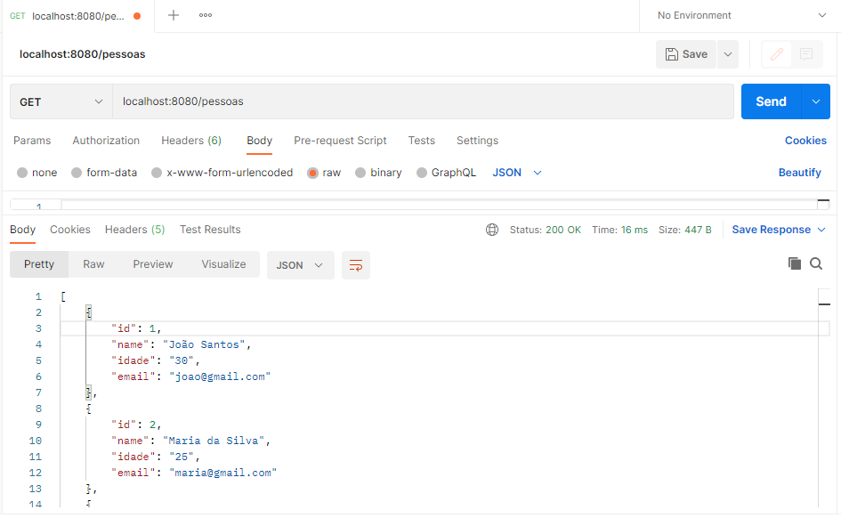
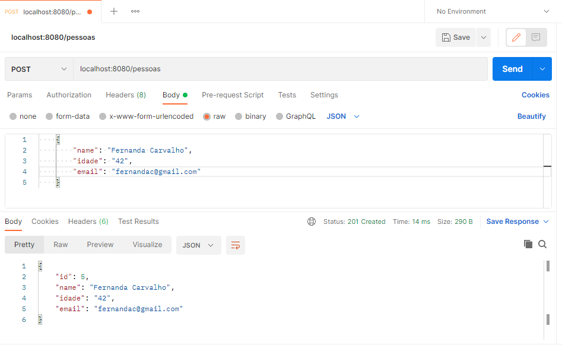
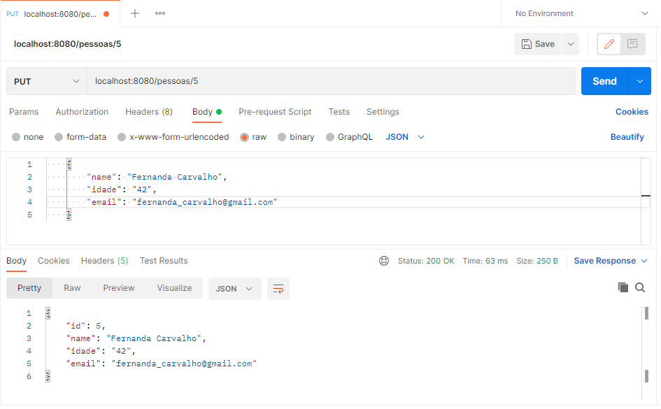
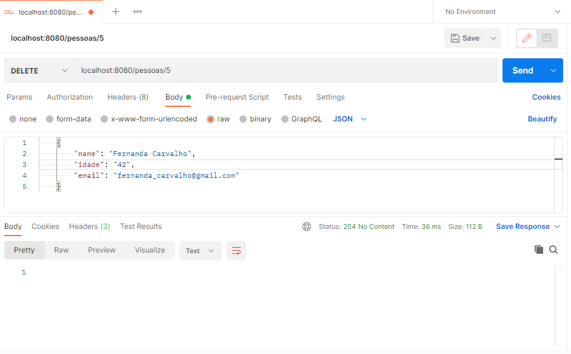

# CRUD REST API COM SPRING BOOT
CRUD em REST com os métodos GET, POST, PUT e DELETE para a classe Pessoa. Escrito em Java, e utilizando a versão mais atual do SPRING, e o banco de dados h2.

### GET
##### Obter lista de pessoas (todas) ou por ID

### POST
##### Criar um novo cadastro

### PUT
##### Alterar um cadastro existente informando o ID

### DELETE
##### Apagar um cadastro existente informando o ID

